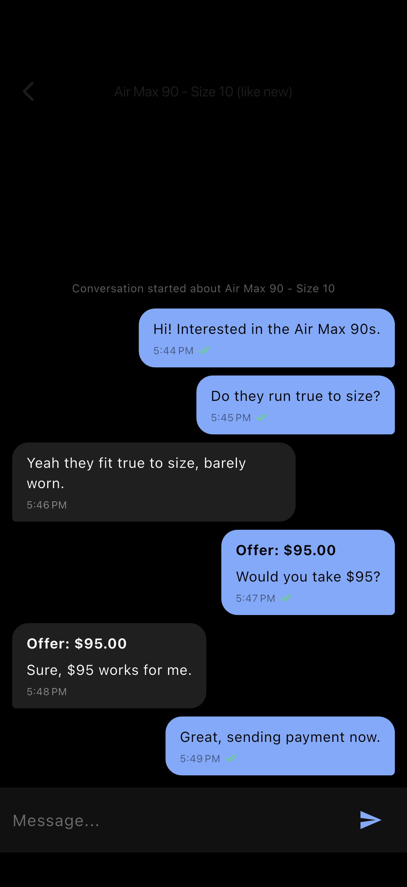
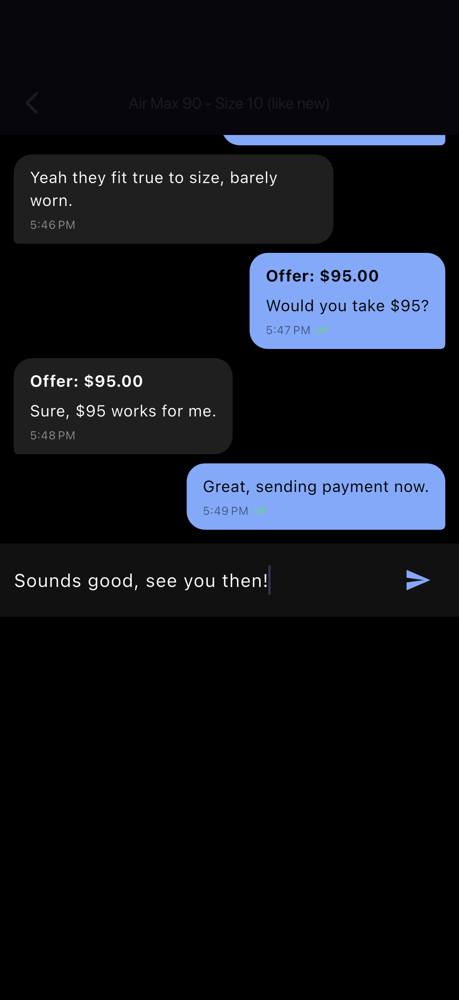

# flutter-realtime-chat-marketplace

Real-time buyer-seller chat for marketplace apps. Flutter + Riverpod + Supabase Realtime.

## Demo

Real captures from the running app on the iOS Simulator (no mockups). See [FLOW.md](FLOW.md) for how they were generated.

| Threads list | Conversation | Composer |
| --- | --- | --- |
|  |  |  |


## Features

- **Per-listing thread model**: each `(listing, buyer, seller)` tuple is one thread (unique constraint)
- **Postgres Changes** subscription per active thread for instant message delivery
- **Broadcast channel** for typing indicators (no DB write)
- **Optimistic send** with rollback on failure
- **Read receipts** with double-check rendering (sent / read)
- **Offer messages** as a first-class message kind, separate from text
- **Row-level security** scoped to thread participants only
- **Riverpod 2.x** with `StateNotifier.family` per-thread + `autoDispose` for memory hygiene

## Schema

`supabase/schema.sql` ships with:
- `chat_threads` with unique `(listing_id, buyer_id, seller_id)`
- `chat_messages` with `kind`, `offer_amount`, `attachment_url`, `read_at`
- RLS policies restricting reads/writes to thread parties
- `supabase_realtime` publication on `chat_messages`

## Run

```bash
flutter pub get
flutter run \
  --dart-define=SUPABASE_URL=https://xxx.supabase.co \
  --dart-define=SUPABASE_ANON_KEY=eyJ...
```

## Why this design

- **Postgres Changes** is the realtime path; **Broadcast** is reserved for ephemeral signals (typing) so we don't write rows we'd never read again
- **Optimistic UI** uses a `tmp-` prefixed id so the server-confirmed message can replace it idempotently
- **`autoDispose` family providers** mean each thread's stream tears down when the screen pops - no leaked subscriptions
